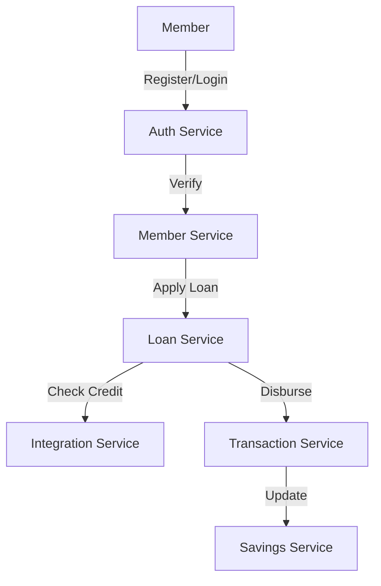

# SACCO System Architecture Documentation

## System Overview
The SACCO system is a microservices-based architecture implementing a comprehensive savings and credit cooperative platform.

## Architecture Components

### Core Services
1. Authentication Service
- Member registration
- Authentication
- Authorization
- Role management

2. Member Service
- Member profile management
- KYC verification
- Document management

3. Loan Service
- Loan application processing
- Credit scoring
- Repayment management

4. Savings Service
- Account management
- Transaction processing
- Interest calculation

### Support Services
1. Notification Service
- Email notifications
- SMS alerts
- Push notifications

2. Reporting Service
- Financial reports
- Member reports
- Compliance reports

3. Integration Service
- Payment gateway integration
- Credit bureau integration
- Bank integration

## Data Flow

## Security Architecture
1. Authentication
- JWT-based authentication
- Role-based access control
- Multi-factor authentication

2. Data Security
- End-to-end encryption
- Data masking
- Audit logging

3. API Security
- Rate limiting
- Request validation
- CORS protection

## Infrastructure
1. Application Servers
- Django application servers
- Gunicorn workers
- Nginx reverse proxy

2. Database
- PostgreSQL clusters
- Read replicas
- Backup strategy

3. Caching
- Redis cache
- Session storage
- Queue management

## Monitoring and Logging
1. Application Monitoring
- Performance metrics
- Error tracking
- User activity

2. System Monitoring
- Server metrics
- Database metrics
- Network metrics

3. Logging
- Application logs
- Access logs
- Error logs

## Disaster Recovery
1. Backup Strategy
- Daily database backups
- Document backups
- Configuration backups

2. Recovery Procedures
- Database recovery
- Application recovery
- Configuration recovery

## Scaling Strategy
1. Horizontal Scaling
- Application server scaling
- Database scaling
- Cache scaling

2. Load Balancing
- Request distribution
- Session management
- Cache distribution

## Integration Points
1. External Systems
- Payment gateways
- Credit bureaus
- Banking systems

2. APIs
- RESTful APIs
- Webhook endpoints
- Integration protocols